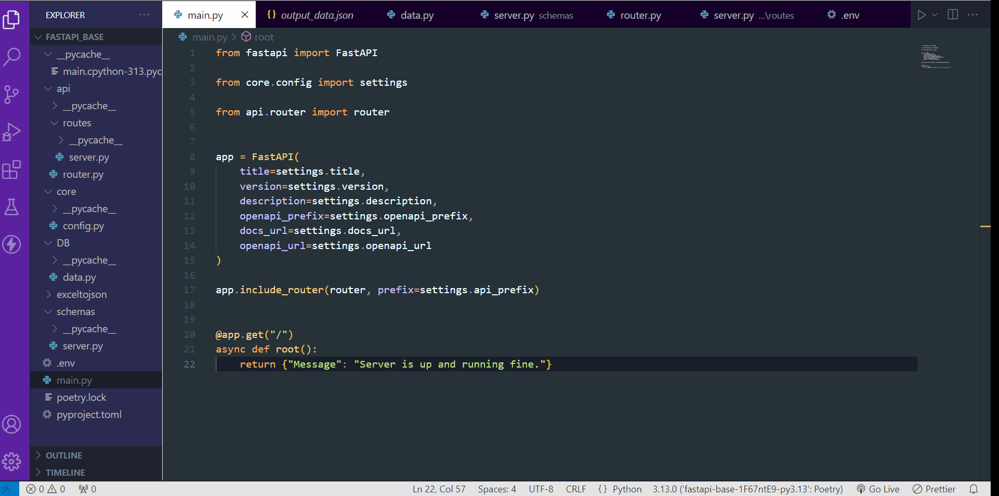

# Fast API Base Project
This project is a basic FastAPI application that demonstrates how to set up a REST API with a few key components such as routing, environment configuration, schema validation, and dependency management.

 * ## Project Demostration:

   
